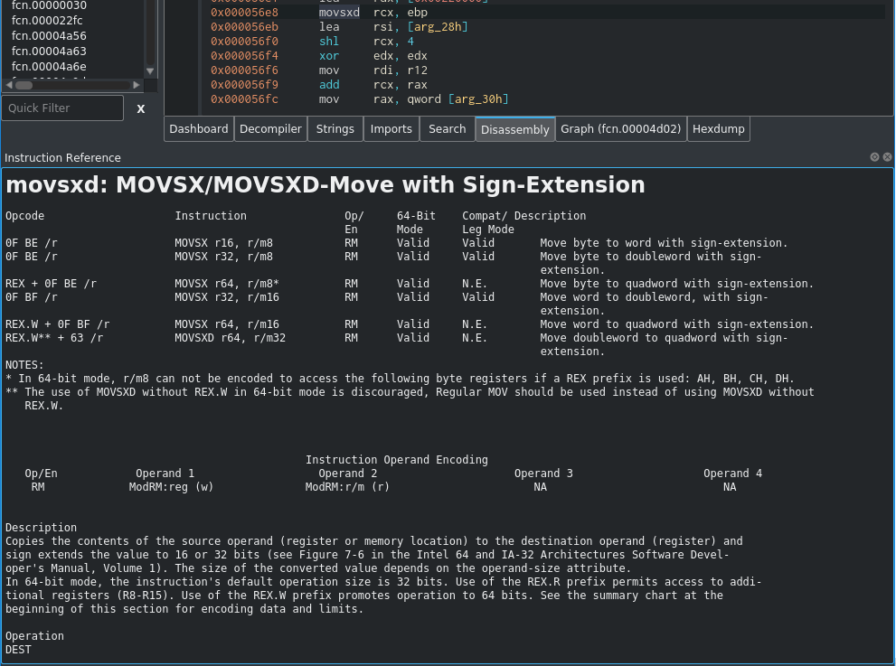

IdaRef
======
Cutter Full Instruction Reference Plugin.

Ported from the excellent [IdaRef plugin by nologic](https://github.com/nologic/idaref).

The plugin will monitor the location for your cursor and display the full
documentation of the instruction. At the moment it only supports x86-64, ARM and MIPS 32bit, 
however adding support for other architectures is relatively easy.

Usage
-----
Simply checkout or download the repository and copy `cutterref.py` and `archs` to your cutter plugins directory ([locating the plugins directory](https://github.com/radareorg/cutter/blob/master/docs/source/plugins.rst#loading-and-overview)).

Internals
---------
Upon loading the script will look for SQlite databases in the same directory as the 
itself. The naming convention for the database files is [arch name].sql. The 
[arch name] will be presented to the user as choice.

The database has a table called 'instructions' and two columns called 'mnem' and
'description'. The instructions are looked up case insensitive (upper case) by the
mnem value. The text from description is displayed verbatim in the view.

To add support for more architectures simply create a new database with those
columns and place it in the the script directory.

    import sqlite3 as sq
    con = sq.connect("asm.sqlite")
    con.text_factory = str
    cur = con.cursor()
    cur.execute("CREATE TABLE IF NOT EXISTS instructions (platform TEXT, mnem TEXT, description TEXT)")
    con.commit()
    
When working with x86, I noticed that many instructions point to the same documentation.
So, the plugin supports single level referencing. Just place '-R:[new instruction]' into
description to redirect the loading. 'new instruction' is the target. So, when loading 
the script will detect the link and load the new target automatically.

    cur.execute("INSERT INTO instructions VALUES (?, ?, ?)", ("x86", inst, "-R:%s" % first_inst))
    
Skeletons in the closet
-----------------------
The documentation database was created using a rather hackish screen scraping
technique by the x86doc project which I forked. So, there are probably some 
strange characters or tags in the text. At least, it is a mechanical process
so I expect that the information is correct relative to the original Intel PDF.

Enjoy!
------
